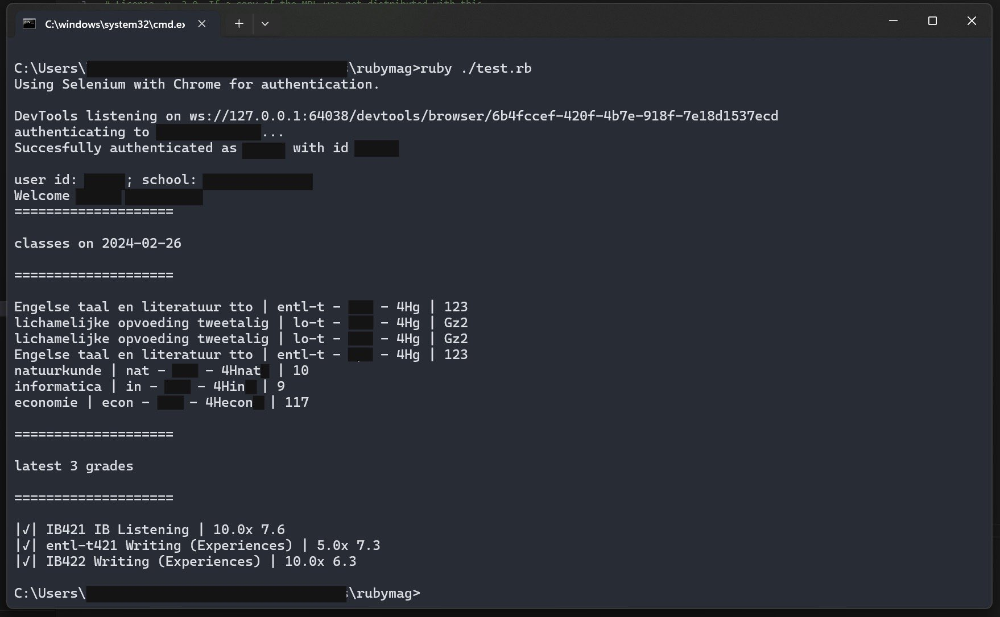

# rubymag
[](https://opensource.org/licenses/MPL-2.0)

[](https://ko-fi.com/I2I4UTRLH)

[](https://github.com/riley0122/rubymag/pkgs/rubygems/magister)
[](https://rubygems.org/gems/magister)

A pretty generic wrapper for the magister, specifically magister 6, api.

# Basic usage

You can simply create a new instance of the magister class.

```ruby
require 'magister'

magister = Magister.new
```

Then you can log the user with their school, username, and password.
```ruby
magister.login("someSchool", "123456", "p@s5W0rd!")
```

Since version 1.2.1 profile verifiying all happens automagically!

Then the user is logged in and you can get the user data!
```ruby
puts "Welcome #{magister.profile.person.firstName} #{magister.profile.person.lastName}!"
puts "You have succesfully logged in to #{magister.profile.school}."
```

For more in depth documentation, [see the docs](https://riley0122.github.io/rubymag)

# Example

This is the output from [this very simple code](https://github.com/riley0122/rubymag/blob/84d8b68f02525181708b8ef7448d34470d386abe/test.rb)

Personal details are blanked out in this image.


